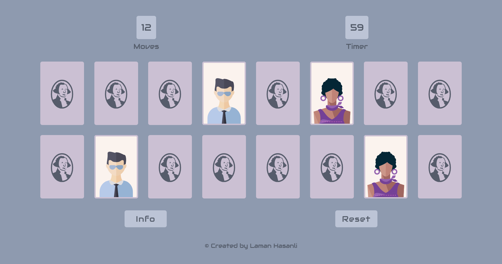

# Matching Cards Game

This is a source code for the card matching game.

## Table of contents

- [Overview](#overview)
  - [Description](#description)
  - [Screenshot](#screenshot)
  - [Links](#links)
- [My process](#my-process)
  - [Built with](#built-with)
- [Author](#author)

## Overview

### Description

Users should be able to:

- View the optimal layout for the site depending on their device's screen size
- See the number of moves and how much time is left
- See the matched cards
- Be notified when they won or lose game
- Reset game anytime and start again

### Screenshot

### Links

- Solution URL: [https://github.com/HasanliLaman/cards](https://github.com/HasanliLaman/cards)
- Live Site URL: [https://cards-hasanlilaman.netlify.app/](https://cards-hasanlilaman.netlify.app/)

## My process

### Built with

- Semantic HTML5 markup
- CSS custom properties
- Grid
- Mobile-first workflow
- Javascript

## Author

- Github - [Laman Hasanli](https://github.com/HasanliLaman)
